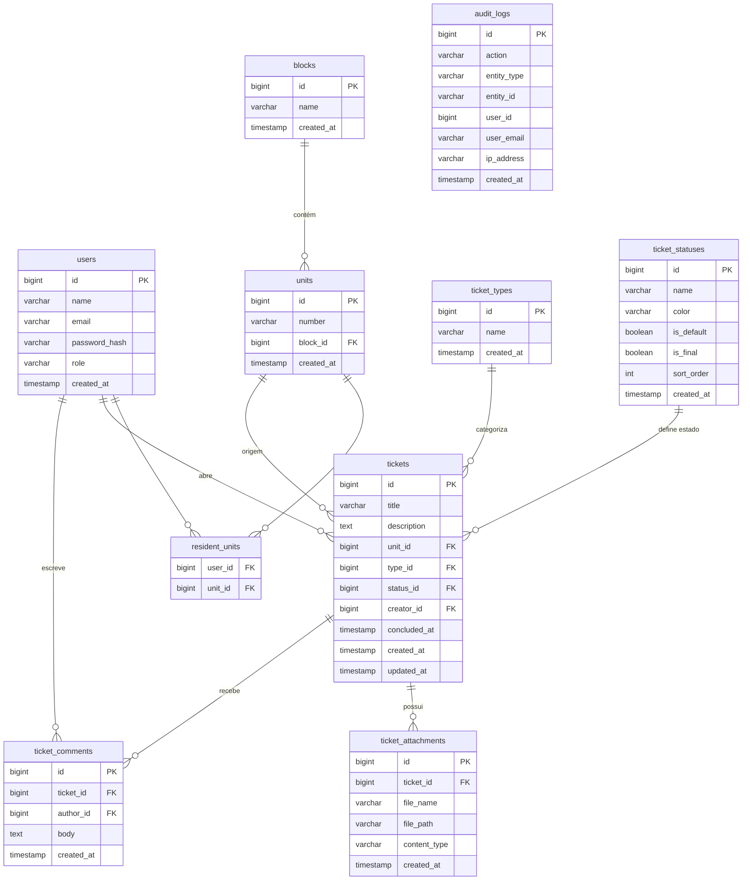

# Desafio Dunnas N° 0004/2026
**Sistema de Gerenciamento de Chamados para Condomínio**

> Stack: Java 21 · Spring Boot 3.4.5 · JSP · PostgreSQL 16 · Flyway · Docker Compose

---

## Início rápido

### Com Docker (recomendado)

```bash
git clone <url-do-repositório>
cd desafio
docker compose up --build
```

Acesse: **http://localhost:8080**

### Sem Docker (execução local)

**Pré-requisitos:** Java 21 JDK, Maven 3.9+, PostgreSQL 16 rodando localmente.

```bash
# 1. Crie o banco de dados
psql -U postgres -c "CREATE DATABASE condominio;"
psql -U postgres -c "CREATE USER condominio WITH PASSWORD 'condominio123';"
psql -U postgres -c "GRANT ALL PRIVILEGES ON DATABASE condominio TO condominio;"

# 2. Build e execução
./mvnw spring-boot:run
```

O Flyway criará todas as tabelas e dados iniciais automaticamente na primeira execução.

---

## Demo

Acesse a aplicação em produção: **https://desafio-dunnas2026-1.onrender.com**

> O serviço está hospedado no Render (free tier) e pode levar ~60s para iniciar após período de inatividade.

---

## Credenciais iniciais

| Perfil | E-mail | Senha |
|--------|--------|-------|
| Administrador | `admin@condominio.com` | `Admin@123` |

> Novos usuários (colaboradores e moradores) devem ser criados pelo administrador após o primeiro login.

---

## Perfis de acesso

| Papel | Permissões |
|-------|-----------|
| **ADMIN** | Gerenciar usuários, blocos, unidades, tipos e status de chamados; visualizar todos os chamados |
| **COLLABORATOR** | Visualizar e atualizar status de todos os chamados; adicionar comentários |
| **RESIDENT** | Abrir chamados nas próprias unidades; acompanhar e comentar nos próprios chamados |

---

## Diagrama ER



---

## Estrutura do projeto

```
src/main/java/com/dunnas/desafio/
├── audit/          # AuditLog entity, AuditService, @Auditable, AuditAspect
├── auth/           # AuthController (login/logout), DashboardController
├── block/          # Block + Unit — entity, repository, service, controller, dto
├── comment/        # TicketComment — entity, repository, service, controller, dto
├── config/         # SecurityConfig, WebMvcConfig
├── security/       # SecurityUser, CustomUserDetailsService, RoleBasedSuccessHandler
├── ticket/         # Ticket, TicketType, TicketStatus, TicketSpecification — todos os sub-pacotes
└── user/           # User — entity, repository, service, controller, dto

src/main/webapp/WEB-INF/views/
├── admin/          # dashboard, users, blocks, ticket-types, ticket-statuses
├── auth/           # login
├── layouts/        # header.jsp, footer.jsp
├── resident/       # dashboard, tickets (list + new + detail)
└── staff/          # dashboard, tickets (list + detail)
```

---

## Migrations Flyway

| Arquivo | Conteúdo |
|---------|----------|
| `V1` | Tabela `users` |
| `V2` | Tabelas `blocks`, `units`, `resident_units` |
| `V3` | Tabelas `ticket_types`, `ticket_statuses` |
| `V4` | Tabelas `tickets`, `ticket_attachments` |
| `V5` | Tabelas `ticket_comments`, `audit_logs` |
| `V6` | Dados iniciais: usuário admin, tipos e status padrão de chamados |

---

## Stack técnica

| Camada | Tecnologia |
|--------|-----------|
| Linguagem | Java 21 |
| Framework | Spring Boot 3.4.5 (MVC, Security, Data JPA) |
| View | JSP + JSTL + Bootstrap 5 + Bootstrap Icons |
| Banco de dados | PostgreSQL 16 |
| Migrações | Flyway |
| Build | Maven (WAR packaging) |
| Containerização | Docker Compose (app + postgres) |
| Testes | JUnit 5 + Mockito + MockMvc |

---

## Auditoria

Toda ação crítica é registrada automaticamente via `@Auditable` (AOP):

- Criação de usuário → `USER_CREATED`
- Criação de bloco → `BLOCK_CREATED`
- Criação de chamado → `TICKET_CREATED`
- Atualização de status → `TICKET_STATUS_UPDATED`
- Adição de comentário → `COMMENT_ADDED`

Logs incluem: usuário autenticado, IP de origem, entidade afetada e timestamp.
